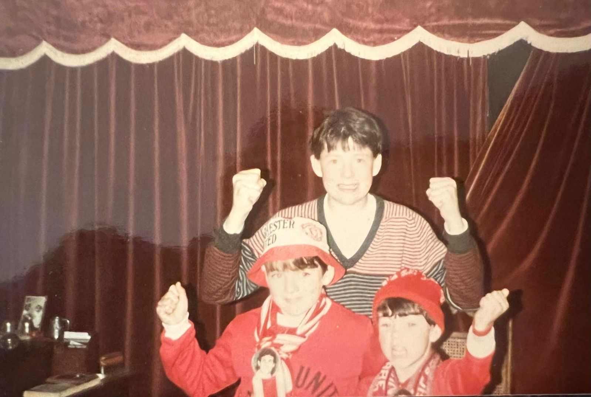

+++
title = 'Back to the Cursor'
date = 2026-03-01T16:14:48Z
slug = 'back-to-the-cursor'
draft = false
[sitemap]
  priority = 0.8
description = 'From the Sinclair Spectrum to AI agents - some patterns do not change.'
[params]
  series_number = 1
  og_image = '/posts/back-to-the-cursor/sinclair-zx-spectrum-villena-1982.jpeg'
  song_title = 'I Will Follow'
  song_artist = 'U2'
  song_year = '1980'
  song_url = 'https://open.spotify.com/track/40lKv5fLpzPHV1YQ7nrfMg'
+++

From the Sinclair Spectrum to AI agents - some patterns do not change.

I wasn’t expecting to see a Sinclair Spectrum on the wall of a startup office in rural Spain.

Every month I travel from Madrid to [Villena](https://en.wikipedia.org/wiki/Villena), where [Luzia](https://luzia.com) was founded. It’s a small town - vineyards, mountains, steady rhythm. Not the obvious birthplace of a company building at the edge of AI.

Framed on the wall: a black rubber keyboard with a thin rainbow stripe in the corner.

A [Sinclair ZX Spectrum](https://en.wikipedia.org/wiki/ZX_Spectrum).

And instantly, I was back in Dublin.

Even then, the fascination wasn’t the machine itself; it was mediation - a tiny interface between human intent and system behaviour.







## The Ferry, the Fixtures, and the Ritual

I grew up in Sutton on the north side of Dublin. I’m the eighth of nine children. My father was a grocer in Raheny - long days, early mornings, steady discipline.

Every summer, the ritual began in July when the football fixtures were announced in *Shoot* magazine. That’s when the debate started: which October or November match would we travel for?

The trip itself was simple. Friday evening ferry from Dublin to Liverpool. Train across to Manchester. Match at Old Trafford. A quick pilgrimage through the Arndale Centre and Argos. Then back the same night - late ferry home, exhausted and happy.

On one of those trips, before I was old enough to go myself, my older brother came home with something unexpected.

A Sinclair Spectrum.

## The Cursor

Before that, the height of technology in our house had been an Atari plugged into the TV, playing Pong.

The Spectrum was different.

It also connected to the television - but instead of paddles, it gave you a blinking cursor.

Games loaded from cassette tapes. You’d press play and hear that strange analogue screech - minutes of electronic noise while you waited to see if it would work.

*Jetpac*. *Manic Miner*.

But the real magic wasn’t the games.

It was the manual.

Pages of BASIC code you could type in yourself. Line by line. `10 PRINT "HELLO"`.

Those little programs were my first experience of programming. Change a line. Run it. See what happens.

Forty years ago, that cursor felt like an invitation.

At Burrow School in Sutton, around the same period, computers started showing up in class - BBC Micro and Acorn-era machines, as I remember it. It was a multi-denominational school, Protestant and Catholic together, which felt normal to us and quietly formative in hindsight.

One detail still makes me smile: teachers asked families to donate typewriters so we could learn typing as part of “computer literacy.”

In hindsight it was absurd, but it captured something real about the transition: everyone could see a new system arriving, but nobody was sure where the skill boundary actually was.

## 1994

In 1994 I walked into [Dublin City University](https://www.dcu.ie/) to study computer applications.

I hadn’t grown up around PCs. The first time I sat down at a Windows NT workstation, I genuinely didn’t know which key to press to log in.

Email ran on Solaris machines. You SSH’d into servers to send messages. The web was still experimental. There was no Stack Overflow. If you got stuck, you figured it out - or you didn’t.

In the labs we wrote C++ late into the night. Borland compilers. Crashes. Breakthroughs. A lot of those nights it was just the two of us - me and Andrew Jenkinson - coding in the labs or at his house before I had a PC of my own. He later co-founded [vStream](https://vstream.ie/) in Ireland, a hugely successful player in virtual reality experiences. Eventually there was a Gateway 2000 in my bedroom.

That’s where obsession really took hold.

## Villena

Standing in Villena, looking at that Spectrum on the wall, I felt the loop close.

Back then, compute was scarce and shared. You waited for tapes to load. You worked in terminals. You were precise because you had to be.

Today, compute is abundant - and shared again. The terminal is back. The blinking cursor is still there; now it’s a prompt window.

The bottleneck has shifted from typing to thinking.

That is what “back to the cursor” means now: not nostalgia, but a return to intent as the real constraint.

When typing was slow, thinking was hidden.  
Now thinking is exposed.

I’m dictating parts of this using [Wispr Flow](https://wisprflow.ai/). Speaking to an AI instead of typing. The system understands my spelling mistakes and reshapes ideas if I’m not careful. It forces clarity - not in syntax, but in intent.

Forty years ago I waited for a cassette to load.

Now I sometimes wait for tokens to refresh.

Different medium. Same energy.

## Obsession, Then and Now

The thread that feels most consistent is obsession.

In the early days it was late nights in labs, handwritten notes, code manuals, and repeated loops until things broke less often.

Now it’s AI-assisted coding: faster loops, tighter feedback, more experimentation in less time.

Throughput changed. Intensity didn’t.

When building is slower than thinking, frustration creeps in. When building speed gets closer to thought speed, obsession comes back.

That shift is not just personal. It is a systems signal.

## Madrid

Dublin, Washington DC, Brussels, Berlin, Madrid - different cities, different stacks, but the same recurring questions: identity, trust, interfaces, and how humans hand agency to systems.

After nearly three decades in software, I feel something familiar again.

Curiosity.  
Speed.  
Possibility.

It would be easy to romanticise this moment. I won’t.

But there’s something quietly fitting about building AI systems in a company that started in a small Spanish town and being reminded it began with a rubber keyboard and a blinking cursor.

In the next post, [Uno. Dos. Tres. Catorce.](/posts/uno-dos-tres-catorce/), I'll go back to Hannover Quay in 2002-2004 - where I was working on a concept very close to what we're building at Luzia now, just before the technology was ready for it.

The obsession has come back in loops: first at home with the Spectrum, then in the labs as a student, and now with AI-assisted coding.

One blinking cursor loop is closed. Another is open.

> Friday evening, 16 November 1985: My first trip to Manchester. [United 0-0 Spurs](https://youtu.be/27lVhIm_wOA?si=epiMaxG98Z2zj_qX), 54,575 in Old Trafford. That's me in the bucket hat - I didn't know it yet, but it was rehearsal for a different kind of obsession with Manchester that involved the Stone Roses, the Happy Mondays and Oasis
