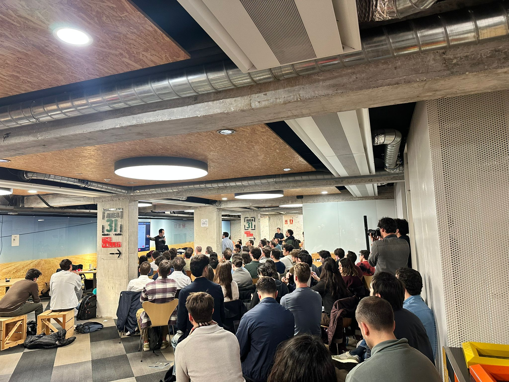
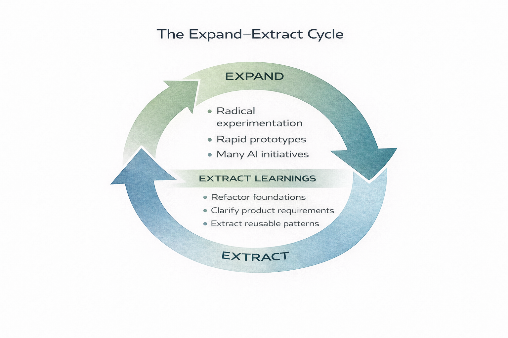
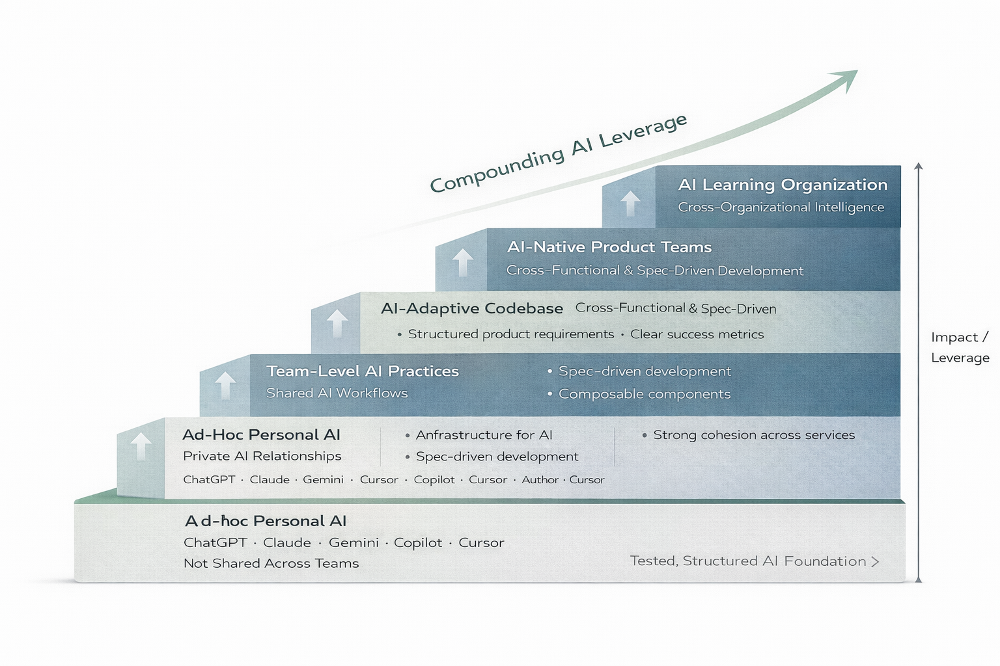
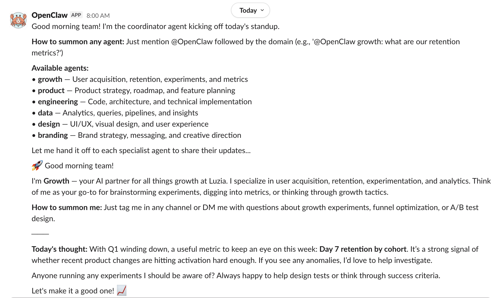

+++
title = 'Expand. Extract.'
date = 2026-03-06T10:00:00Z
slug = 'expand-extract'
draft = false
description = 'How to build agent systems without drowning in possibility.'
[sitemap]
  priority = 0.8
[params]
  series_number = 3
  og_image = '/posts/expand-extract/openclaw-madrid.jpeg'
  song_title = 'Where Is My Mind?'
  song_artist = 'Pixies'
  song_year = '1988'
  song_url = 'https://open.spotify.com/track/0KzAbK6nItSqNh8q70tb0K'
+++

On a rainy Thursday evening in Madrid, over a hundred and fifty people packed into a lecture hall at IE University for [ClawCon](https://claw-con.com/) - the first European meetup for [OpenClaw](https://github.com/openclaw/openclaw), an open-source AI agent that didn't exist a month ago.

Three hundred and fifty people had signed up. Standing room only.

*ClawCon Madrid, IE University, March 5, 2026.*

I was there because of [Joe Haslam](https://www.ie.edu/university/about/faculty/joe-haslam/) - a larger-than-life Corkman at IE who has been a great help to me in settling in Madrid.
Two months earlier he had invited me to speak to his MBA class about AI and product innovation. When ClawCon sold out, he got me in anyway.

The Irish network in Madrid is small but disproportionately useful. You arrive in a new city, and somewhere in the first few months, someone from home opens a door you didn't know existed.

A month earlier, almost nobody was talking about OpenClaw. Peter Steinberger built it. It went viral. He joined OpenAI. Within weeks the repo had six-figure stars on GitHub. The speed of it is worth sitting with for a moment.

The room felt like a room in expand mode. People sharing experiments. Demos. Early integrations. Speakers from [Docplanner](https://www.docplanner.com/), [WAME Sports](https://wame.es/), [Dappnode](https://dappnode.com/). One talk on [agent security](https://www.clawsight.ai/) - because when you expand fast enough, the need for extraction follows you into the room.

I recognised the energy. I've felt it before.

The question is what you do with it.

## The Pattern

[Dan North](https://dannorth.net/) has a pattern he calls [Spike and Stabilise](https://dannorth.net/blog/on-craftsmanship/). The idea is simple: don't decide upfront whether you're writing production code or a throwaway experiment. Ship the spike. Get real feedback. Then, once you know it's valuable, stabilise - invest in tests, architecture, edge cases. Get it into a state anyone can confidently change.

I think about it as expand and extract. It applies far beyond code.

**Expand**: explore possibilities. Test interaction models. Try things that might not work. Let complexity grow temporarily. This is where innovation happens.

**Extract**: consolidate what works. Remove what doesn't. Create structure from chaos. This is where reliability happens.

The cycle is not expand *or* extract. It is expand *then* extract *then* expand again.

Most teams fail in one of two ways:

They under-expand and call it focus.
They over-expand and call it innovation.

Both are avoidance. Under-expansion avoids uncertainty. Over-expansion avoids commitment.

## Why This Matters Now

In earlier eras, constraints were obvious. Less bandwidth. Less compute. Less distribution. Less tooling. The friction was real and it kept things honest.

Today, technical possibility expanded faster than organisational discipline. So the limiting factor moved from capability to architecture.

That shift catches leadership teams off guard.

When everything is possible, the hardest decision is not what to build. It is what to stabilise.

## A Staircase, Not an Elevator

This is how organisations actually adopt AI.
Not the conference version. The inside-the-building version.

It looks like a staircase:

**Stage 1: Ad-hoc Personal AI.** Individual engineers using ChatGPT, Claude, Copilot. No coordination. Private relationships with tools. This is where most companies still are, even the ones that think they're further along.

**Stage 2: Team-Level AI Practices.** Shared workflows. Prompt libraries. Team-level tooling decisions. The shift from "I use AI" to "we use AI."

**Stage 3: AI-Adaptive Codebase.** The codebase itself becomes structured for agent consumption. Good boundaries. Clear contracts. Testable modules. Structured product requirements. This is the stage most teams skip - and then wonder why agents produce inconsistent results.

**Stage 4: AI-Native Product Teams.** Product development assumes AI participation. Sprint planning includes AI capacity. Architecture decisions account for agent capabilities.

**Stage 5: AI Learning Organization.** The organisation learns and adapts through AI feedback loops. This is [Peter Senge's](https://en.wikipedia.org/wiki/Peter_Senge) [Fifth Discipline](https://en.wikipedia.org/wiki/The_Fifth_Discipline) applied to AI - systemic, not just tooling.

Each stage requires the previous one. In the teams I've worked with, you cannot build an AI Learning Organization without AI-Native Product Teams, which require an AI-Adaptive Codebase, which requires Team-Level Practices, which require individuals who actually know how to use the tools.

I call this the elevator illusion: companies trying to jump from Stage 1 to Stage 4. "We'll just deploy agents across the org." It is like trying to take an elevator in a building that only has stairs.

The expand-extract cycle is how you climb. Expand into the next stage. Extract what works. Consolidate. Then expand again.

## What Happened at Luzia

In January we did our product roadmap off-site. We committed to features for delivery by March.

Then the world moved.

I had joined [Luzia](https://luzia.com) as CTO at the end of November 2025. That freed our CEO, Alvaro, to spend more time on research and innovation. In February I hired a technical lead for the backend, which freed me up to focus on more experimental work.

So even while delivering on our January commitments, we had enough bandwidth to run agentic coding experiments that were not on the roadmap.
Through growing AI-assisted coding skills, we developed two new products - unplanned work made possible by the productivity gains from AI adoption.

The expand phase was not planned. It emerged from organisational changes that created slack. The AI capability amplified that slack into actual new products.

That is the staircase in action. Stage 1 to Stage 2 created enough velocity that innovation happened alongside committed roadmap work. Nobody told us to do it. The tooling made it possible and curiosity did the rest.

## The OpenClaw Experiment

OpenClaw arrived in early February 2026. Within Luzia, we set up a dedicated Slack channel and deployed specialist agents for each cohort - growth, product, engineering, data, design, branding.

A coordinator agent runs a daily standup. It hands off to the specialists. The growth agent proactively flags cohort metrics worth watching as Q1 winds down.

*OpenClaw coordinator and growth agent running standup at Luzia.*

We managed tool access deliberately: [Amplitude](https://amplitude.com/) for analytics, GitHub for code, Notion for docs, G Suite. We observed how teams interacted with agents, what questions they asked, and the quality of answers they received.

One insight stood out. My colleague Natalia, our product manager, was able to get answers from OpenClaw that were harder to extract from Amplitude directly. The agent became an interface to analytics - reframing data access through conversation rather than dashboards.

But agents also confidently make things up. One morning, the coordinator briefed me on our plans to migrate to GraphQL - a conversation that had never happened anywhere in the company. The agent had invented a technical strategy and presented it as fact. That is the expand phase in miniature: genuine insight and confident hallucination arriving in the same channel, often in the same breath. Every output still needs verification against the source system before it becomes a decision.

Then we ran a more radical experiment. We tried to have OpenClaw manage the full product development of one of Luzia's characters - extracting it from the codebase and letting the agent handle the product lifecycle. We got iOS and Android proof of concepts working.

This is pure expand mode. Seeing how far it goes.

## The Moment You Have to Ask

And then the questions arrive.

Should we reorganise our codebase and APIs to support AI-managed product flows? If so, what human-in-the-loop gates do we need - pull requests, reviews, structured requirements? How do we close the loop properly?

These are extract questions. And they only make sense because we expanded first. You cannot design the right architecture for AI-managed workflows without first seeing what AI-managed workflows actually look like in practice.

This maps directly to Stage 3 on the staircase: AI-Adaptive Codebase. The expand experiment tells you what to extract.

But here is the thing about agents: they create a feeling of expanded capability. You move into areas you would not normally touch. You experiment with things that were previously too expensive to try. And that is genuinely powerful.

It is also genuinely dangerous.

Because experimentation creates chaos. And agents can give you a false sense of security about what is actually possible versus what is merely a demo.

The critical discipline is pausing to recognise which cycle you are in.

Are we expanding? Then let it breathe. Accept mess. Explore.
Are we extracting? Then consolidate. Cut. Ship what is real.

Without that awareness, expand never becomes extract. You accumulate proof of concepts that never become products. The agent does not know when to stop expanding. That is the human judgment layer.

## The Cost of Expanding

At Luzia we are open with budget for AI tokens. We encourage experimentation. In February, we saw a significant spike in developer AI tooling costs. We had to reset budget guardrails.

This is a real extract moment: uncontrolled expansion of AI usage creates cost pressure, which forces deliberate decisions about what to keep, what to scale, and what to cut.

We started using [Pensero](https://pensero.ai/) to correlate AI usage with value created - understanding the actual impact of AI on product engineering productivity through usage patterns, not surveys. That is extract-phase tooling: measuring the expand phase so you can make informed decisions.

## A Window Into What Comes Next

Experimenting so freely with OpenClaw gave us ideas about what is possible in the Luzia product itself. OpenClaw, in a way, was a glimpse into the future. It showed what is possible and what the appetite is for those possibilities.

At Luzia it renewed our focus on making such capabilities accessible to our users - but in a much more secure and privacy-focused way.

The pattern repeats. [The previous post](/posts/uno-dos-tres-catorce/) was about [i-Chara](https://i-chara.com) in 2004 - a personal agent with privacy designed in. Now, two decades later, open tooling shows the raw capability again. The job is still the same: extract the version that respects the user.

OpenClaw is the expand. Luzia's product response is the extract.

At ClawCon Madrid, one of the talks covered [ClawSight](https://www.clawsight.ai/) - an EDR platform for AI agent security. The fact that agent security tooling already exists shows how fast the expand-extract cycle is running at the industry level. Expand into agents. Extract the governance. The cycle does not wait.

## The Real Constraint

The old constraint was compute.

The current constraint is coherence.

The teams that win this cycle will not be the teams that experimented most. They will be the teams that extracted the right architecture from their experiments.

Expand widely. Extract decisively. Expand again.

The cycle does not just reshape your codebase. It eventually reshapes your org chart.

*Next in the series*: [F*** You, Gemini.](/posts/f-you-gemini/) - A year of AI-assisted coding, building ContextRocket.

*Part 2 of this series*: [Uno. Dos. Tres. Catorce.](/posts/uno-dos-tres-catorce/) - The Shape of Agents Before the World Was Ready.

*Part 1 of this series*: [Back to the Cursor](/posts/back-to-the-cursor/)
